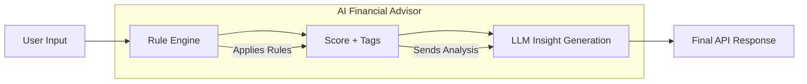

# Financial Health Analyzer — AI Rule Engine + LLM Challenge 2025

**Author:** Kwabena Boateng Konadu

## 1. Summary
A financial health analysis system that evaluates personal financial data, applies rule-based scoring, and generates AI-powered insights to help users understand and improve their financial well-being.

## 2. Problem & Domain
### Domain: Personal Finance Management
- **Why it matters**: Financial literacy is crucial for personal well-being, yet many struggle with understanding their financial health.
- **Use Cases**:
  - Personal budget analysis
  - Spending pattern recognition
  - Savings optimization
  - Financial habit tracking

## 3. Architecture


### Components:
1. **Data Ingestion**: Accepts JSON input
2. **Rule Engine**: Processes data through financial rules
3. **Scoring System**: Generates scores and tags
4. **LLM Layer**: Produces natural language insights
5. **API Layer**: REST endpoint for interaction

### Dependencies:
- Python 3.8+
- FastAPI
- Hugging Face Transformers
- loguru
- uvicorn

## 4. Data & Schema
### Input Format (JSON):
```json
{
  "Name": "string",
  "currency": "string",
  "target_net_worth": number,
  "current_net_worth": number,
  "set_salary": number,
  "history": [
    {
      "month": "YYYY-MM",
      "salary": number,
      "spending": number,
      "saving": number,
      "metadata": {
        "primary_expense_category": "string",
        "investment_allocation": number
      }
    }
  ]
}
```

## 5. Rule Engine
### Financial Rules
| Rule | Condition | Effect |
|------|-----------|--------|
| Savings Rate | < 10% of income | -4 points |
| Savings Rate | 10-20% of income | +1 point |
| Savings Rate | > 20% of income | +3 points |
| Spending Trend | Increasing > 30% | -3 points |
| Spending Trend | Decreasing > 10% | +2 points |
| Income Stability | Fluctuating income | -2 points |
| Burn Rate | > 80% of income | -3 points |
| Burn Rate | < 30% of income | +3 points |
| Investment Allocation | > 50% of savings | +2 points |

### Scoring:
- Final score: -10 to 10
- Negative: Needs attention
- Positive: Good financial health

## 6. LLM Layer
### Provider: Hugging Face (moonshotai/Kimi-K2-Thinking)

### Prompt Template:
```
You are a financial advisor. 
Analyze this financial data and provide insights:

{analysis_results}

Provide clear, actionable insights and recommendations in 2-3 paragraphs. Focus on:
1. Key financial health indicators
2. Areas of concern
3. Practical recommendations
4. Long-term financial planning advice
```

## 7. API Usage
### Endpoint: `POST /analyze`

### Request Example:
```json
{
  "Name": "Kwabena Boateng",
  "currency": "GHS",
  "target_net_worth": 1000000,
  "current_net_worth": 5000,
  "set_salary": 8500,
  "history": [
    {
      "month": "2024-01",
      "salary": 8500,
      "spending": 4200,
      "saving": 4300,
      "metadata": {
        "primary_expense_category": "Rent/Utilities",
        "investment_allocation": 0
      }
    }
  ]
}
```

### Response Example:
```json
{
  "status": "success",
  "analysis": {
    "tags": ["High Savings Rate", "Stable Spending"],
    "score": 8,
    "note": "Score is between -10 to 10"
  },
  "insight": "Your financial health is strong with a high savings rate..."
}
```

## 8. Quickstart
1. Clone the repository:
   ```bash
   git clone https://github.com/officiallykbk/Ai_FinancialAdvisorBSTHACKATHON.git
   cd BstHackathon
   ```

2. Install dependencies:
   ```bash
   pip install -r requirements.txt
   ```

3. Set up environment variables:
   ```bash
   cp .env.example .env
   # Add your Hugging Face API key
   ```

4. Run the application:
   ```bash
   uvicorn main:app --reload
   ```

5. Access the API at `http://localhost:8000`

6. Test the `/analyze` endpoint with sample data

## 9. Future Improvements
- Add user authentication
- Implement data persistence
- Create a dashboard UI
- Add investment tracking
- Multi-currency support
- ML-powered forecasts

---

*Documentation last updated: November 2025*  
*For BUILD SciTech AI Rule Engine + LLM Challenge 2025*
```